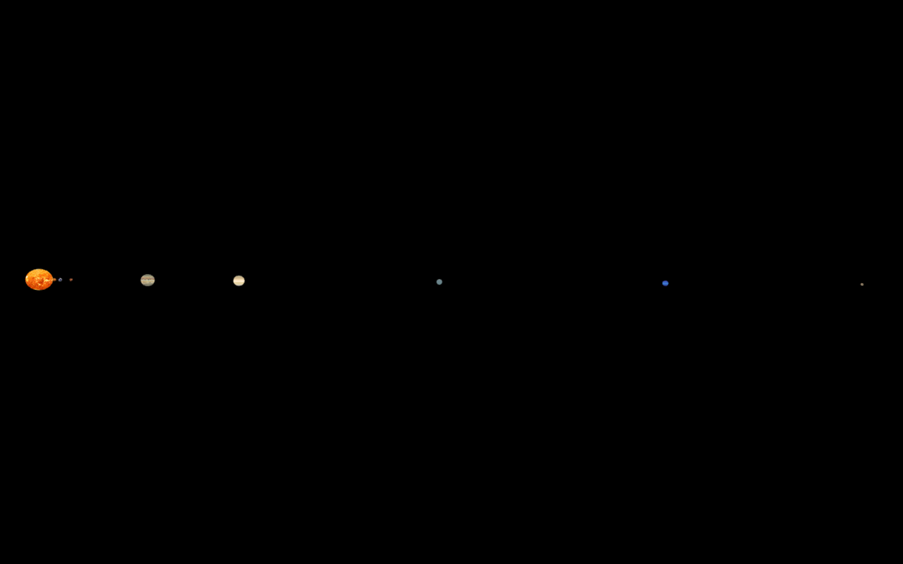

# DEVELOPMENT

## Library Exploration
I mostly experimented with manipulating different 3d shapes using OpenFramework's 3d library. of3dPrimitives contains the tools to create different shapes like a sphere and icosphere. I was able to manipulate the sizes of the icosphere's, as well as how fast they rotated.

## Week 1
- Created class called CelestialBody to encapsulate all the information about each celestial body. Variables include the name, texture, image, ofSpherePrimitive, radius, orbit, orbit radius, and rotations. The methods currently just have getters and setters.
- Simulation now includes a background and both Earth and Sun

## Week 2
- Created CelestialBody objects including actual data from the solar system
- Got static scale model of solar system working with actual distances and radiuses scaled, however the differences in distance and size made most planets come off screen. When distance was scaled smaller, the planets began to combine with each other.

- Updated model so that the radius's of the planets were normalized to come closer to the average. With the normalized sizes but regularly scaled distances, the planets spread across too far.

- Both distances from sun and radius's of planets are scaled to be closer to average.

## Sources
Planet Radius's and Distances from Sun: https://nssdc.gsfc.nasa.gov/planetary/factsheet/

