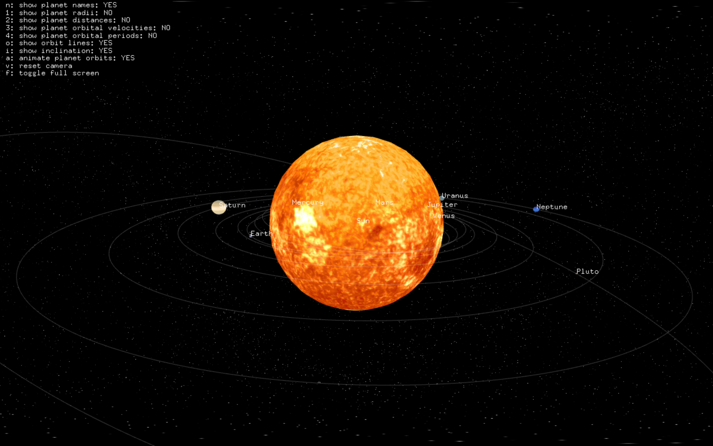
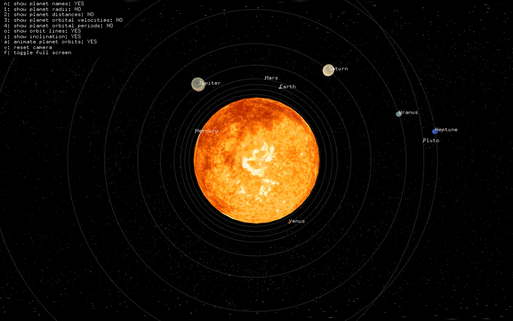
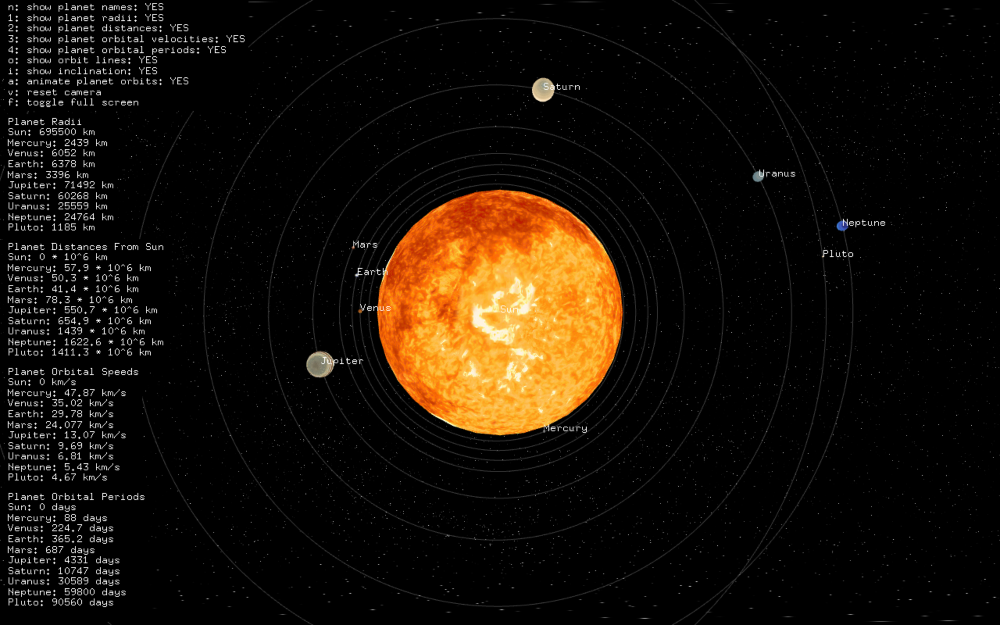
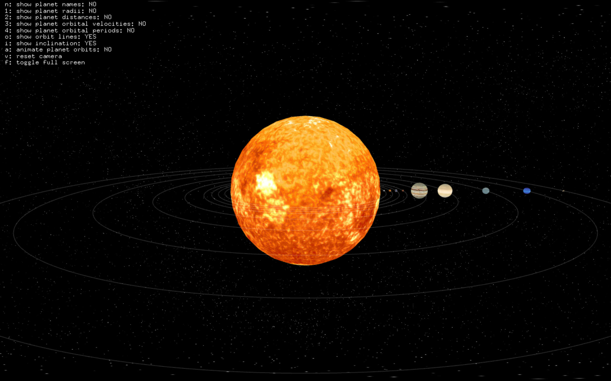

# Solar System 3D Simulator

An interactive map of the solar system, showing the sun and the different planets. It can be used as a tool to learn the size proportions of the celestial bodies as well as their movement patterns. 

### Features
* Display information about planet radii, distances from the sun, orbital periods, and orbital velocities.
* See orbit lines
* See planets orbit sun at their actual inclination
* View animation for planets revolving around sun
* Revolve camera to see system from different views

Users can choose how much information is displayed on the left side.

Users can also choose if the solar system is viewed with the orbital inclines or not.

### Sources
Planet Information: https://nssdc.gsfc.nasa.gov/planetary/factsheet/
